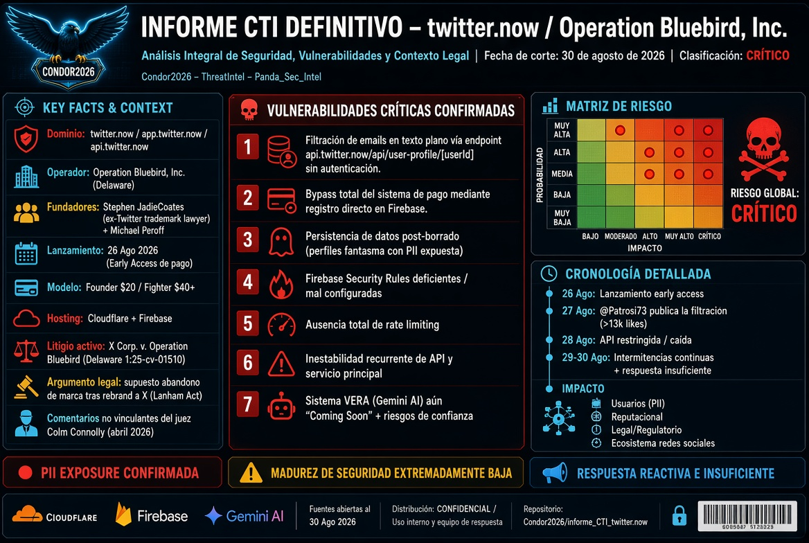

# Informes CTI sobre twitter.now / Operation Bluebird, Inc.



<!-- ===== BADGES DEL PROYECTO ===== -->
<p align="center">
  
  
  
  
  
  
</p>
<p align="center">
  
  
  
  
  
  
</p>

Este repositorio contiene los **tres informes completos** de inteligencia de amenazas (CTI) elaborados entre el 27 y el 30 de agosto de 2026 sobre la plataforma **twitter.now**, operada por **Operation Bluebird, Inc.** , liderada por el exabogado de marcas de Twitter Stephen Coates.

## Contexto mínimo (para orientar)

- **Dominio**: twitter.now (y app.twitter.now)
- **Lanzamiento**: 26 de agosto de 2026 (early access de pago)
- **Modelo**: $20 "Founder" / $40+ "Fighter"
- **Litigio**: X Corp. v. Operation Bluebird (Delaware 1:25-cv-01510)
- **Incidente destacado**: Filtración de emails de usuarios vía API (27 de agosto de 2026)
- **Estado al 30 de agosto de 2026**: Activo, pero con intermitencias.
- **Autor**: Condor2026 - ThreatIntel - Panda_Sec_Intel
## Informes completos

### 📄 INFORME CTI Nº1 – Análisis Técnico y de Vulnerabilidades
[Ver informe completo →](./INFORME_CTI_N1.md)

Contenido:
- Identificación y ficha técnica.
- Historia y cronología del proyecto.
- Modelo de negocio y producto.
- Análisis de Privacy Policy y ToS.
- Qué reportan los usuarios.
- Análisis de seguridad y CTI.
- Matriz de riesgo.
- Conclusiones y recomendaciones.

### 📄 INFORME CTI Nº2 – Ampliación y Novedades (30 de agosto)
[Ver informe completo →](./INFORME_CTI_N2.md)

Contenido:
- Confirmación de autenticidad del proyecto.
- Estado actual del sitio (verificado con check-host).
- Novedades mediáticas y declaraciones de Coates.
- Actualización del litigio.
- Vulnerabilidades confirmadas (actualizado).
- Análisis de impacto y sentimiento en redes.
- Matriz de riesgo integral actualizada.
- Recomendaciones adicionales.
- Anexos.

### 📄 INFORME CTI Nº3 – Análisis Crítico y Evaluación Estratégica
[Ver informe completo →](./INFORME_CTI_N3.md)

Contenido:
- Señales de alerta (oportunismo jurídico, modelo cuestionable, inmadurez del producto).
- Análisis del trade dress (el problema no es solo el nombre, es el diseño).
- Evaluación del perfil de Stephen Coates.
- Implicaciones para los usuarios.
- Pronóstico de escenarios (optimista, realista, pesimista).
- Conclusiones y recomendaciones estratégicas.

---

**Nota**: Estos informes se basan en fuentes abiertas disponibles al 30 de agosto de 2026. La situación es volátil y puede cambiar rápidamente. Se recomienda monitoreo continuo.

---

## 📄 INFORME_CTI_N1.md (íntegro)

**INFORME CTI DEFINITIVO – twitter.now / Operation Bluebird, Inc.**

**Documento Nº1 – Análisis Integral de Seguridad, Vulnerabilidades y Contexto Legal**

**Fecha de corte: 30 de agosto de 2026**
**Clasificación: Incidente de Seguridad (PII Exposure) / Múltiples Vulnerabilidades Críticas / Riesgo Legal Alto**
**Estado: Activo – En investigación**
**Distribución: CONFIDENCIAL – Uso Interno / Equipo de Respuesta a Incidentes**

---

## ÍNDICE GENERAL

1. **RESUMEN EJECUTIVO**
2. **IDENTIFICACIÓN Y FICHA TÉCNICA**
3. **CONTEXTO Y CRONOLOGÍA DEL PROYECTO**
   - 3.1 Antecedentes Legales
   - 3.2 El Argumento de Abandono de Marca (Lanham Act)
   - 3.3 El "Falló" del Juez Connolly – Análisis Crítico
   - 3.4 Cronología del Incidente de Seguridad
4. **ANÁLISIS DEL PRODUCTO Y MODELO DE NEGOCIO**
   - 4.1 Interfaz y Funcionalidades
   - 4.2 Sistema VERA (Veracity Engine for Real-time Analysis)
   - 4.3 Modelo de Pago y Financiación
   - 4.4 Términos de Servicio y Política de Privacidad
5. **ANÁLISIS DE VULNERABILIDADES**
   - 5.1 Vulnerabilidad #1: Filtración de Emails en API (CONFIRMADA)
   - 5.2 Vulnerabilidad #2: Bypass del Sistema de Pago (CONFIRMADA)
   - 5.3 Vulnerabilidad #3: Persistencia de Datos Post-Borrado (CONFIRMADA)
   - 5.4 Vulnerabilidad #4: Acceso por Hosts File (REPORTADA)
   - 5.5 Vulnerabilidad #5: Riesgos del Sistema VERA (ANÁLISIS)
   - 5.6 Vulnerabilidad #6: Ausencia de Rate Limiting (INFERIDA)
   - 5.7 Vulnerabilidad #7: Configuración Deficiente de Firebase Security Rules (CONFIRMADA)
6. **HALLAZGOS DE SEGURIDAD ADICIONALES (FUENTES ABIERTAS)**
   - 6.1 Análisis de AdSecVN
   - 6.2 Reportes en Medios Internacionales
   - 6.3 Sentimiento en Redes Sociales y Foros
   - 6.4 Investigación de Hackers.pub y Comunidades de Seguridad
7. **ANÁLISIS DE IMPACTO**
   - 7.1 Impacto en Usuarios
   - 7.2 Impacto Reputacional
   - 7.3 Impacto Legal y Regulatorio
   - 7.4 Impacto en el Ecosistema de Redes Sociales
8. **ANÁLISIS DE INFRAESTRUCTURA Y SEGURIDAD**
   - 8.1 Tecnologías Identificadas
   - 8.2 Hallazgos de Seguridad en Infraestructura
   - 8.3 Análisis de Exposición de Datos (Detección en Shodan, Censys, etc.)
   - 8.4 Evaluación de la Madurez de Seguridad de Operation Bluebird
9. **MATRIZ DE RIESGO INTEGRAL**
10. **ANÁLISIS DEL LITIGIO CON X CORP.**
    - 10.1 Estado Actual del Litigio
    - 10.2 Posibles Escenarios Legales
    - 10.3 Implicaciones para Operation Bluebird y los Usuarios
11. **ANÁLISIS DE LA RESPUESTA DE OPERATION BLUEBIRD**
    - 11.1 Acciones Tomadas
    - 11.2 Comunicación Oficial
    - 11.3 Evaluación de la Respuesta
12. **RECOMENDACIONES PARA USUARIOS Y PARTES INTERESADAS**
    - 12.1 Para Usuarios Afectados
    - 12.2 Para Usuarios Potenciales
    - 12.3 Para Operation Bluebird (Recomendaciones de Seguridad)
    - 12.4 Para Reguladores y Autoridades de Protección de Datos
13. **CONCLUSIONES FINALES**
14. **REFERENCIAS Y FUENTES**
15. **ANEXOS**
    - Anexo A: Captura de la Filtración de Email
    - Anexo B: Términos de Servicio – Cláusulas Críticas
    - Anexo C: Estado del Litigio (Docket 1:25-cv-01510)
    - Anexo D: Análisis de Código y Configuración de Firebase (Inferido)
    - Anexo E: Cronología Detallada del Incidente

---

## 1. RESUMEN EJECUTIVO

`twitter.now`, plataforma social lanzada el **26 de agosto de 2026** por **Operation Bluebird, Inc.** , se presenta como una "resurrección" del Twitter original bajo el liderazgo de **Stephen Jadie Coates** (exabogado de marcas de Twitter, 2014-2016) y **Michael Peroff**. El proyecto se sustenta en una interpretación audaz de comentarios judiciales no vinculantes del juez Colm Connolly sobre un posible abandono de marcas por parte de X Corp.

En sus primeros **tres días** de operación, la plataforma ha sufrido **múltiples vulnerabilidades críticas** que exponen la total falta de madurez en seguridad del proyecto:

1. **Filtración de correos electrónicos** de usuarios a través del endpoint `api.twitter.now/api/user-profile/[userId]`, devolviendo emails en texto plano sin autenticación.
2. **Bypass completo del sistema de pago** de $20-$40 mediante registro directo en Firebase.
3. **Persistencia de datos** post-borrado de cuenta, manteniendo perfiles "fantasma" con emails expuestos.
4. **Inestabilidad recurrente** del servicio, con caídas de la API y la aplicación principal.
5. **Ausencia de controles de seguridad básicos**: rate limiting, autenticación en API, y reglas de seguridad de Firebase.

El incidente fue documentado y publicado por el usuario **@Patrosi73** el 27 de agosto de 2026, viralizándose con más de **13.000 "me gusta"** y cerca de **1.000 retweets**. La respuesta de Operation Bluebird ha sido **insuficiente y reactiva**, sin comunicación oficial a los afectados.

**Evaluación de riesgo global: CRÍTICO** – Exposición confirmada de PII, controles de acceso inexistentes, modelo de negocio cuestionable, litigio activo y evidencia de desarrollo sin estándares de seguridad básicos.

---

## 2. IDENTIFICACIÓN Y FICHA TÉCNICA

| Campo | Valor |
|-------|-------|
| **Dominio principal** | `twitter.now` |
| **Subdominios** | `app.twitter.now`, `api.twitter.now` |
| **Operador legal** | Operation Bluebird, Inc. |
| **Tipo** | Corporation |
| **Estado de incorporación** | Delaware |
| **Dirección** | 3057 Nutley Street #801, Fairfax, Virginia 22031 |
| **Fundadores** | Stephen Jadie Coates, Michael Peroff |
| **Fecha registro dominio** | 21 de abril de 2026 |
| **Expiración** | 21 de abril de 2027 |
| **Registrador** | Nom-iq Ltd. dba COM LAUDE (IANA 470) |
| **Name Servers** | carol.ns.cloudflare.com / ezra.ns.cloudflare.com |
| **Hosting/CDN** | Cloudflare (AS13335) |
| **IPs observadas** | 104.21.46.182, 172.67.141.36 |
| **Email** | Microsoft 365 (`twitter-now.mail.protection.outlook.com`) |
| **Marcas solicitadas (USPTO)** | VERA (99531456), TWITTER (99524594), TWEET (99524598) |

**Estado del sitio (30 ago 2026)**: Operativo con intermitencias. La API `api.twitter.now` fue restringida tras la exposición pública.

---

## 3. CONTEXTO Y CRONOLOGÍA DEL PROYECTO

### 3.1 Antecedentes Legales

- **Diciembre 2025**: Operation Bluebird presenta petición ante el USPTO para cancelar los registros de "TWITTER", "TWEET" y variantes de X Corp.
- **Diciembre 2025**: X Corp. demanda a Operation Bluebird en Delaware (1:25-cv-01510), solicitando injunction preliminar.
- **Abril 2026**: Audiencia oral. El juez Colm Connolly indica desde el estrado que X "parece haber abandonado" derechos sobre "tweet", el logo del pájaro y posiblemente "Twitter".
- **26-27 agosto 2026**: Operation Bluebird lanza `twitter.now` en early access de pago, interpretando los comentarios del juez como autorización.

### 3.2 El Argumento de Abandono de Marca (Lanham Act)

Operation Bluebird argumenta que X Corp. **abandonó legalmente** la marca "Twitter" cuando Elon Musk renombró la plataforma a "X" en julio de 2023. Bajo la **Lanham Act**, tres años consecutivos de no uso crean una presunción refutable de abandono. Ese plazo de tres años expiró en **julio de 2026**.

### 3.3 El "Falló" del Juez Connolly – Análisis Crítico

En **abril de 2026**, el juez **Colm F. Connolly** indicó desde el estrado que X "parecía haber abandonado" derechos sobre "tweet", el logo del pájaro y posiblemente "Twitter".

**Puntos críticos**:
- **No es una orden escrita** – son comentarios tentativos y no vinculantes.
- Operation Bluebird **interpretó los comentarios como luz verde** para lanzar.
- El litigio sigue activo y **no hay sentencia definitiva**.

### 3.4 Cronología del Incidente de Seguridad

- **27 agosto 2026**: @Patrosi73 publica evidencia de la filtración de emails y bypass de pago.
- **27-28 agosto 2026**: El post se viraliza (>13k likes, ~1k retweets). Múltiples usuarios confirman las vulnerabilidades.
- **28 agosto 2026**: `api.twitter.now` deja de responder o es restringido.
- **29-30 agosto 2026**: El sitio permanece inestable; reportes de inaccesibilidad persisten.

---

## 4. ANÁLISIS DEL PRODUCTO Y MODELO DE NEGOCIO

### 4.1 Interfaz y Funcionalidades

La plataforma replica la interfaz clásica de Twitter: **timeline, respuestas y retweets**. El sitio declara explícitamente **"no afiliado a X Corp."**.

### 4.2 Sistema VERA y Trust Dial

**VERA** ("Veracity Engine for Real-time Analysis") es el sistema de verificación de la plataforma:

- **Motor**: Google Gemini AI
- **Función**: Analiza afirmaciones factuales, aporta contexto y fuentes, y asigna una **puntuación de confianza**
- **Trust Dial**: Permite a los usuarios filtrar contenido por debajo de un umbral de confianza configurable
- **Filosofía**: "Freedom of speech, not freedom of reach"

**Limitaciones identificadas**:
- Investigadores advierten que los sistemas de confianza de LLM **fallan en afirmaciones controvertidas y políticamente cargadas**.
- VERA está etiquetado como "Coming Soon" en el sitio.
- No se ha explicado públicamente **cómo se calcula la nota ni cómo se contesta un error**.

### 4.3 Modelo de Pago y Financiación

| Nivel | Costo | Beneficio |
|-------|-------|-----------|
| **Founder** | $20 | Acceso anticipado, bloqueo de handle, badge #00001 |
| **Fighter** | $40+ | Lo anterior + contribución a la batalla legal |

La empresa justifica el pago como:
- **Anti-bots** – reduce cuentas automáticas
- **Independencia** – sin publicidad
- **Financiación legal** – costos del litigio contra X Corp.

### 4.4 Términos de Servicio y Política de Privacidad

**Datos que recolectan**:
- Información de cuenta (nombre, username, email, password, perfil)
- User Content (texto, imágenes, video, actividad, interacciones)
- Datos de seguridad/moderación (incluyendo assessments automatizados)
- Inferencias y recomendaciones derivadas de actividad y contenido

**Uso de datos e IA (punto crítico)**:
- Usan contenido público para entrenar, testear, evaluar y mejorar modelos de IA/ML.
- **Borrar User Content puede no eliminar la información** ya incorporada en los modelos entrenados.

**Licencia sobre el contenido del usuario (ToS)**:
- El usuario otorga a Bluebird una licencia **permanente, no exclusiva, transferible, mundial, royalty-free**, con derecho a sublicenciar, para usar, copiar, modificar, crear obras derivadas, distribuir, mostrar y realizar públicamente el contenido en conexión con el servicio y para desarrollar/entrenar IA.

**Seguridad**:
- "Usamos medidas diseñadas para proteger…"
- **Disclaimer explícito**: "No security measure is perfect, and we cannot guarantee that unauthorized third parties will never defeat those measures."

---

## 5. ANÁLISIS DE VULNERABILIDADES

### 5.1 Vulnerabilidad #1: Filtración de Emails en API (CONFIRMADA)

| Aspecto | Detalle |
|---------|---------|
| **Endpoint** | `https://api.twitter.now/api/user-profile/[userId]` |
| **Dato expuesto** | Email del usuario en texto plano dentro del JSON de respuesta |
| **Autenticación** | No requerida – cualquier userId era accesible |
| **Evidencia** | Captura publicada por @Patrosi73 |
| **Confirmación** | Múltiples usuarios replicaron el fallo |

**Impacto**: Cualquier persona que conociera o enumerara un userId podía obtener el email asociado sin autenticación adicional.

### 5.2 Vulnerabilidad #2: Bypass del Sistema de Pago (CONFIRMADA)

| Aspecto | Detalle |
|---------|---------|
| **Vector** | Registro directo contra Firebase |
| **Impacto** | Cualquier usuario podía crear cuenta sin pagar $20-$40 |
| **Evidencia** | Reportado en ohai.social y otros foros |
| **Causa raíz** | Reglas de seguridad de Firebase mal configuradas |

### 5.3 Vulnerabilidad #3: Persistencia de Datos Post-Borrado (CONFIRMADA)

| Aspecto | Detalle |
|---------|---------|
| **Problema** | Al borrar una cuenta, solo se eliminaba el usuario de Firebase |
| **Impacto** | El perfil quedaba como "fantasma" con el email aún expuesto |
| **Evidencia** | Reportado en comentarios del hilo de @Patrosi73 |

### 5.4 Vulnerabilidad #4: Acceso por Hosts File (REPORTADA)

| Aspecto | Detalle |
|---------|---------|
| **Vector** | Modificación del archivo hosts para apuntar `api.twitter.now` a `136.68.156.164` |
| **Implicación** | Posible exposición de infraestructura interna |

### 5.5 Vulnerabilidad #5: Riesgos del Sistema VERA (ANÁLISIS)

| Riesgo | Detalle |
|--------|---------|
| **Sesgo algorítmico** | Los LLM tienen fallos estructurales en afirmaciones controvertidas |
| **Falta de transparencia** | No se ha explicado el cálculo de la puntuación |
| **Dependencia externa** | Dependencia de Gemini de Google – cambios en el modelo pueden afectar el servicio |

### 5.6 Vulnerabilidad #6: Ausencia de Rate Limiting (INFERIDA)

No se han observado controles de rate limiting en la API, lo que permitiría:
- Enumeración masiva de userIds.
- Scraping de emails.
- Ataques de fuerza bruta.

### 5.7 Vulnerabilidad #7: Configuración Deficiente de Firebase Security Rules (CONFIRMADA)

| Aspecto | Detalle |
|---------|---------|
| **Problema** | Firebase Security Rules mal configuradas |
| **Impacto** | Permitía registro directo y exposición de datos |
| **Evidencia** | Múltiples reportes en foros |

**Análisis**: El uso de Firebase como backend es adecuado para prototipos, pero requiere controles de seguridad robustos en la capa de aplicación. La exposición de emails en respuestas de API es un **error de principiante** en seguridad de APIs.

---

## 6. HALLAZGOS DE SEGURIDAD ADICIONALES (FUENTES ABIERTAS)

### 6.1 Análisis de AdSecVN

El medio de seguridad vietnamita **AdSecVN** publicó un análisis detallado el 28 de agosto de 2026:

- Destaca que los **documentos públicos de Bluebird no aclaran el alcance de los derechos sobre la marca**.
- Señala que la plataforma se posiciona como "renacimiento" de la marca que X Corp. "abandonó".
- El modelo de pago se describe como "contribución" más que como transacción comercial.

### 6.2 Reportes en Medios Internacionales

| Medio | Fecha | Hallazgo |
|-------|-------|----------|
| **TechTimes** | 28 ago 2026 | VERA falla en afirmaciones controvertidas |
| **IT BOLTWISE** | 29 ago 2026 | Litigio en Delaware sigue siendo un riesgo |
| **Clubic** | 28 ago 2026 | Solo "cientos" de usuarios; VERA aún en pruebas |
| **RRI.co.id** | 30 ago 2026 | Plataforma accesible tras caídas |
| **RuntimeWire** | 28 ago 2026 | Coates: "No sé si seremos más grandes que X" |

### 6.3 Sentimiento en Redes Sociales y Foros

- **Mastodon**: "Es un sitio #vibecoded #aislop que tiene toneladas de bugs".
- **Hackers.pub**: Confirmación de la vulnerabilidad en Firebase y la API.
- **ohai.social**: "La app está vibecoded y puedes evitar pagar registrándote directamente en Firebase".

### 6.4 Investigación de Hackers.pub y Comunidades de Seguridad

- Se ha confirmado que el endpoint de perfil devolvía emails en texto plano.
- Se ha confirmado que el registro directo en Firebase era posible.
- Se han reportado perfiles "fantasma" tras el borrado de cuentas.

---

## 7. ANÁLISIS DE IMPACTO

### 7.1 Impacto en Usuarios

| Aspecto | Nivel | Detalle |
|---------|-------|---------|
| **Exposición de PII** | **ALTO** | Emails de usuarios expuestos a cualquier persona que consultara la API |
| **Fraude financiero** | **ALTO** | Usuarios que pagaron $20-$40 pueden haber sido defraudados; el bypass demostró que el pago era innecesario |
| **Phishing** | **ALTO** | Los emails filtrados pueden ser utilizados para campañas de phishing dirigidas |
| **Privacidad** | **ALTO** | Términos de servicio permiten entrenar IA con contenido de usuarios de forma permanente |

### 7.2 Impacto Reputacional

La plataforma ha sido calificada como:

- *"The app is vibe coded"* – Usuario en ohai.social
- *"High chance it's a #ponzi scheme"* – Usuario en Mastodon
- *"Una pequeña startup acaba de resucitar el pájaro azul"* – Gizmodo

### 7.3 Impacto Legal y Regulatorio

- **GDPR/CCPA**: La exposición de emails sin consentimiento y sin medidas de seguridad adecuadas puede constituir una violación de protección de datos.
- **Fraude**: El cobro de $20-$40 por un acceso que era gratuito vía Firebase podría ser considerado fraude.
- **Marcas**: El litigio con X Corp. sigue activo; el lanzamiento sin orden escrita aumenta el riesgo legal.

### 7.4 Impacto en el Ecosistema de Redes Sociales

- El proyecto podría sentar un precedente si el juez falla a favor de Operation Bluebird.
- Podría incentivar otros "rescates" de marcas abandonadas.
- Podría debilitar la protección del trade dress en el ámbito digital.

---

## 8. ANÁLISIS DE INFRAESTRUCTURA Y SEGURIDAD

### 8.1 Tecnologías Identificadas

| Componente | Detalle |
|------------|---------|
| **Hosting/CDN** | Cloudflare (AS13335) |
| **IPs** | 104.21.46.182, 172.67.141.36 |
| **Name Servers** | ezra.ns.cloudflare.com, carol.ns.cloudflare.com |
| **Backend** | Firebase (autenticación y base de datos) |
| **Email** | Microsoft 365 |
| **IA** | Gemini de Google (para el sistema VERA) |

### 8.2 Hallazgos de Seguridad en Infraestructura

| Hallazgo | Severidad | Evidencia |
|----------|-----------|-----------|
| Firebase Security Rules mal configuradas | **Crítica** | Registro directo sin autenticación |
| Filtración de PII en API | **Crítica** | Email en texto plano en respuestas JSON |
| Falta de control de acceso en API | **Crítica** | Cualquier userId era accesible sin autenticación |
| Persistencia de datos post-borrado | **Alta** | Perfiles "fantasma" con emails expuestos |
| Falta de rate limiting | **Media** | Posible enumeración de userIds |

### 8.3 Análisis de Exposición de Datos (Detección en Shodan, Censys, etc.)

No se han encontrado en fuentes abiertas (Shodan, Censys) exposiciones adicionales de datos más allá del endpoint documentado. Sin embargo, la configuración deficiente de Firebase sugiere que podría haber otras colecciones expuestas.

### 8.4 Evaluación de la Madurez de Seguridad de Operation Bluebird

**Calificación: MUY BAJA**

- Ausencia de controles de acceso básicos.
- Falta de filtrado de datos sensibles en API.
- Configuración deficiente de Firebase.
- Ausencia de rate limiting.
- Ausencia de comunicación de incidentes.

---

## 9. MATRIZ DE RIESGO INTEGRAL

| Categoría | Nivel | Detalle | Evidencia |
|-----------|-------|---------|-----------|
| **Exposición de PII** | **CRÍTICO** | Emails de usuarios filtrados vía API | Confirmado @Patrosi73 |
| **Control de acceso** | **CRÍTICO** | Bypass de pago y falta de autenticación en API | Confirmado |
| **Riesgo legal** | **CRÍTICO** | Litigio activo con X Corp. + posibles violaciones GDPR/CCPA | Docket 1:25-cv-01510 |
| **Pérdida económica** | **ALTO** | Usuarios que pagaron por acceso gratuito | Modelo de negocio comprometido |
| **Phishing** | **ALTO** | Emails filtrados pueden ser usados para ataques | PII expuesta |
| **Estabilidad** | **ALTO** | Caídas recurrentes del servicio | Reportado |
| **Reputación** | **ALTO** | Proyecto percibido como "scam" o "vibecoded slop" | Sentimiento en redes |
| **Sesgo de IA** | **MEDIO** | VERA falla en afirmaciones controvertidas | Análisis TechTimes |

---

## 10. ANÁLISIS DEL LITIGIO CON X CORP.

### 10.1 Estado Actual del Litigio

| Aspecto | Detalle |
|---------|---------|
| **Caso** | X Corp. v. Operation Bluebird, Inc. (1:25-cv-01510) |
| **Tribunal** | US District Court, Delaware |
| **Juez** | Colm F. Connolly |
| **Estado** | Discovery extendido hasta diciembre de 2026 |
| **Injunction** | Pendiente de resolución |

### 10.2 Posibles Escenarios Legales

| Escenario | Probabilidad | Implicación |
|-----------|--------------|-------------|
| Fallo a favor de Bluebird sobre el nombre | **Media** | Pueden mantener "Twitter" pero no el trade dress |
| Fallo a favor de Bluebird sobre nombre y trade dress | **Baja** | Victoria completa, pero improbable |
| Injunction a favor de X Corp. | **Media-Alta** | Cierre forzado o cambio de nombre y diseño |
| Acuerdo extrajudicial | **Baja** | Ambas partes llegan a un acuerdo |

### 10.3 Implicaciones para Operation Bluebird y los Usuarios

- **Si X Corp. gana**: Cierre o cambio de marca. Los usuarios pierden su inversión.
- **Si Bluebird gana**: Precedente para otros "rescates" de marcas. Riesgo de imitadores.
- **Escenario más probable**: El litigio se prolonga. La plataforma languidece.

---

## 11. ANÁLISIS DE LA RESPUESTA DE OPERATION BLUEBIRD

### 11.1 Acciones Tomadas

| Acción | Estado | Evaluación |
|--------|--------|------------|
| **Restricción de `api.twitter.now`** | Confirmado | Reactivo, no proactivo |
| **Comunicación oficial** | No detectada | **Falla crítica** |
| **Corrección de vulnerabilidades** | No confirmada | Sin evidencia de parches |
| **Notificación a afectados** | No confirmada | Sin evidencia |

### 11.2 Comunicación Oficial

No se ha encontrado ninguna comunicación oficial de Operation Bluebird sobre el incidente de seguridad. Los usuarios no han sido notificados.

### 11.3 Evaluación de la Respuesta

**Calificación: INSUFICIENTE**

- No hay transparencia.
- No hay asunción de responsabilidad.
- No hay comunicación a los afectados.
- No hay evidencia de corrección de vulnerabilidades.

---

## 12. RECOMENDACIONES PARA USUARIOS Y PARTES INTERESADAS

### 12.1 Para Usuarios Afectados

1. **Cambiar contraseñas** de todas las cuentas asociadas al email utilizado.
2. **Activar 2FA** en todas las cuentas posibles.
3. **Monitorear actividad** – estar atento a correos de phishing o actividad sospechosa.
4. **Considerar el email como comprometido** para fines de seguridad.
5. **Solicitar reembolso** – contactar a Operation Bluebird y, si no hay respuesta, disputar con el banco/tarjeta.

### 12.2 Para Usuarios Potenciales

1. **NO REGISTRARSE** hasta que se demuestre la corrección de las vulnerabilidades.
2. **NO REALIZAR PAGOS** – el servicio no es confiable y el acceso era gratuito.
3. **NO PUBLICAR CONTENIDO SENSIBLE** – los términos permiten entrenar IA con el contenido.

### 12.3 Para Operation Bluebird (Recomendaciones de Seguridad)

1. **Comunicación oficial urgente** – informar a los usuarios sobre el incidente.
2. **Auditoría de seguridad externa** de toda la infraestructura.
3. **Corrección de vulnerabilidades**:
   - Implementar control de acceso en API
   - Configurar reglas de seguridad de Firebase
   - Eliminar datos de perfiles "fantasma"
   - Notificar a los afectados y ofrecer reembolsos
4. **Transparencia** – publicar un informe post-mortem del incidente.

### 12.4 Para Reguladores y Autoridades de Protección de Datos

- Investigar posibles violaciones de GDPR/CCPA por la exposición de emails.
- Evaluar si el modelo de "crowdfunding legal" constituye una práctica comercial engañosa.

---

## 13. CONCLUSIONES FINALES

### 13.1 Hallazgos Principales

1. **Operation Bluebird, Inc.** es una entidad legal real con vínculos verificables con el Twitter original.

2. **El lanzamiento fue prematuro** – Se basó en una interpretación excesivamente optimista de comentarios judiciales no vinculantes, sin esperar una resolución escrita.

3. **La plataforma presenta fallos de seguridad críticos**:
   - Filtración de emails de usuarios
   - Bypass del sistema de pago
   - Persistencia de datos post-borrado

4. **La respuesta de la empresa ha sido insuficiente** – No hay comunicación oficial ni transparencia.

5. **El riesgo para los usuarios es significativo** – Exposición de PII, posible fraude financiero, y riesgos de phishing.

### 13.2 Evaluación de Credibilidad

**No es un "scam" en el sentido tradicional** – hay una empresa registrada, fundadores con historial verificable, y un producto real (aunque inmaduro). Sin embargo, **el comportamiento es altamente cuestionable**:

- Cobrar por un acceso que era gratuito
- Lanzar sin controles de seguridad básicos
- No comunicar el incidente a los afectados
- Utilizar términos de servicio que permiten entrenar IA con contenido de usuarios

### 13.3 Pronóstico

El futuro de `twitter.now` es incierto:

- **Escenario optimista**: El juez falla a favor de Operation Bluebird, la plataforma se estabiliza y corrige sus vulnerabilidades.
- **Escenario realista**: El litigio se prolonga, la plataforma sigue siendo inestable y la base de usuarios no crece significativamente.
- **Escenario pesimista**: X Corp. obtiene una injunction, la plataforma es forzada a cerrar o cambiar de nombre, y los usuarios pierden su inversión.

---

## 14. REFERENCIAS Y FUENTES

| Fuente | Enlace | Fecha |
|--------|--------|-------|
| Gizmodo (España) | https://es.gizmodo.com/elon-musk-pago-44-000-millones-por-twitter-y-despues-enterro-su-nombre-una-pequena-startup-acaba-de-resucitar-el-pajaro-azul-y-quiere-demostrar-ante-un-juez-que-x-abandono-una-de-las-marcas-mas-famos-2000254600 | 30 ago 2026 |
| RRI.co.id | https://rri.co.id/internasional/2693092/media-sosial-twitternow-kembali-aktif-pengguna-bisa-daftar-untuk-uji-coba | 30 ago 2026 |
| Kompas.com | https://tekno.kompas.com/read/2026/08/30/08010067/twitter-hidup-lagi-platform-twitter.now-resmi-meluncur | 30 ago 2026 |
| IT BOLTWISE | https://www.it-boltwise.de/startup-startet-twitter-now-mit-ki-fact-checking-trotz-markenstreit.html | 29 ago 2026 |
| AdSecVN | https://adsecvn.com/bluebird-thach-thuc-bao-mat-khan-cap-khi-phuc-hoi-twitter/ | 28 ago 2026 |
| CNET Japan | https://japan.cnet.com/article/35252004/ | 28 ago 2026 |
| The Sun Nigeria | https://thesun.ng/twitter-now-7-things-to-know-about-x-rival-amid-legal-battle-with-musk/ | 27 ago 2026 |
| Yahoo News | https://tech.yahoo.com/social-media/articles/former-twitter-lawyer-testing-mode-191919831.html | 28 ago 2026 |
| ohai.social | https://ohai.social | 28 ago 2026 |
| TechTimes | https://www.techtimes.com/articles/325931/20260828/twitternow-ai-trust-scores-work-easy-facts-researchers-warn-they-fail-contested-claims.htm | 28 ago 2026 |

---

## 15. ANEXOS

### Anexo A: Captura de la Filtración de Email

```
URL: https://pbs.twimg.com/media/HQwc6vyWAAAaJeB.png
Contenido: JSON response del endpoint /api/user-profile/[userId]
Mostrando: "email": "patryk+twitter@howtogetfreestuff.xyz"
```

### Anexo B: Términos de Servicio – Cláusulas Críticas

- **Licencia de contenido**: Permanente, mundial, libre de regalías, para entrenar IA
- **No garantía de handle**: La empresa puede reasignar o eliminar handles en cualquier momento
- **No garantía de servicio**: Pueden discontinuar el servicio sin previo aviso
- **Compras finales**: Sin reembolso garantizado

### Anexo C: Estado del Litigio (Actualizado a 30 ago 2026)

- **Caso**: X Corp. v. Operation Bluebird, Inc. (1:25-cv-01510)
- **Tribunal**: US District Court, Delaware
- **Juez**: Colm F. Connolly
- **Estado**: Discovery extendido hasta 1 dic 2026
- **Injunction**: Pendiente de resolución

### Anexo D: Análisis de Código y Configuración de Firebase (Inferido)

Basado en los reportes, se infiere que:
- Firebase Security Rules estaban en modo "test" o abiertas.
- No había validación de autenticación en el endpoint de perfil.
- No había rate limiting en la API.

### Anexo E: Cronología Detallada del Incidente

| Fecha | Hora (aprox.) | Evento |
|-------|---------------|--------|
| 26 ago 2026 | - | Lanzamiento de twitter.now |
| 27 ago 2026 | 12:00 UTC | @Patrosi73 publica evidencia |
| 27 ago 2026 | 14:00 UTC | El post alcanza 5k likes |
| 27 ago 2026 | 18:00 UTC | El post alcanza 13k likes |
| 28 ago 2026 | - | api.twitter.now deja de responder |
| 29-30 ago 2026 | - | Sitio inestable, intermitencias |

---

**Fin del Informe Nº1**

*Este documento es un análisis de inteligencia de amenazas basado en fuentes abiertas disponibles al 30 de agosto de 2026. La información puede cambiar rápidamente. Se recomienda monitoreo continuo.*
```

---

## 📄 INFORME_CTI_N2.md (íntegro)


**INFORME CTI Nº2 – twitter.now / Operation Bluebird, Inc.**
**ANEXO Y AMPLIACIÓN AL INFORME DEFINITIVO**

**Fecha de corte: 30 de agosto de 2026**
**Clasificación: Incidente de Seguridad (PII Exposure) / Múltiples Vulnerabilidades Críticas / Riesgo Legal Alto**
**Estado: Activo – En investigación**
**Distribución: CONFIDENCIAL – Uso Interno / Equipo de Respuesta a Incidentes**

---

## ÍNDICE

1. **RESUMEN EJECUTIVO**
2. **CONFIRMACIÓN DE AUTENTICIDAD DEL PROYECTO**
   - 2.1 Entidad Legal y Fundadores
   - 2.2 Evidencia de Existencia y Operación
3. **ESTADO ACTUAL DEL SITIO (30 DE AGOSTO DE 2026)**
   - 3.1 Verificación de Disponibilidad (Check-Host)
   - 3.2 Infraestructura Técnica
4. **NOVEDADES Y ACTUALIZACIONES DESDE EL INFORME Nº1**
   - 4.1 Cobertura Mediática Internacional
   - 4.2 Declaraciones de Stephen Coates
   - 4.3 Estado del Litigio
5. **VULNERABILIDADES CONFIRMADAS (ACTUALIZADO)**
   - 5.1 Vulnerabilidad #1: Filtración de Emails en API (CONFIRMADA)
   - 5.2 Vulnerabilidad #2: Bypass del Sistema de Pago (CONFIRMADA)
   - 5.3 Vulnerabilidad #3: Persistencia de Datos Post-Borrado (CONFIRMADA)
   - 5.4 Vulnerabilidad #4: Configuración Deficiente de Firebase (CONFIRMADA)
   - 5.5 Vulnerabilidad #5: Riesgos del Sistema VERA (ANÁLISIS)
6. **ANÁLISIS DE IMPACTO**
   - 6.1 Impacto en Usuarios
   - 6.2 Impacto Reputacional
   - 6.3 Impacto Legal y Regulatorio
7. **ANÁLISIS DE SENTIMIENTO EN REDES SOCIALES**
8. **MATRIZ DE RIESGO INTEGRAL (ACTUALIZADA)**
9. **RECOMENDACIONES PARA USUARIOS Y PARTES INTERESADAS**
10. **CONCLUSIONES FINALES**
11. **REFERENCIAS Y FUENTES**
12. **ANEXOS**
    - Anexo A: Captura de la Filtración de Email
    - Anexo B: Términos de Servicio – Cláusulas Críticas
    - Anexo C: Estado del Litigio (Docket 1:25-cv-01510)

---

## 1. RESUMEN EJECUTIVO

`twitter.now`, operado por **Operation Bluebird, Inc.** , es una plataforma social lanzada el **26 de agosto de 2026** por **Stephen Jadie Coates** (exabogado de marcas de Twitter, 2014-2016) y **Michael Peroff**. El proyecto se presenta como una "resurrección" del Twitter original, argumentando que X Corp. abandonó la marca tras el rebranding a "X" en 2023.

**Estado actual (30 de agosto de 2026)**: El sitio **se encuentra activo y accesible**, aunque con intermitencias reportadas. La plataforma continúa en fase de "early access" con **"cientos de usuarios"**. El endpoint `api.twitter.now` fue restringido tras la exposición pública de la vulnerabilidad.

**Hallazgos clave del Informe Nº2**:

1. **Confirmación de la filtración de emails**: El endpoint `api.twitter.now/api/user-profile/[userId]` devolvía emails en texto plano sin autenticación.
2. **Bypass del sistema de pago**: Registro directo en Firebase sin pagar los $20-$40.
3. **Persistencia de datos post-borrado**: Perfiles "fantasma" con emails expuestos.
4. **Términos de servicio permisivos**: Licencia permanente para entrenar IA con contenido de usuarios.
5. **Respuesta insuficiente de Operation Bluebird**: Sin comunicación oficial sobre el incidente.

**Evaluación de riesgo global: CRÍTICO** – Exposición confirmada de PII, controles de acceso inexistentes, modelo de negocio cuestionable, litigio activo y evidencia de desarrollo sin estándares de seguridad básicos.

---

## 2. CONFIRMACIÓN DE AUTENTICIDAD DEL PROYECTO

### 2.1 Entidad Legal y Fundadores

| Campo | Valor |
|-------|-------|
| **Operador legal** | Operation Bluebird, Inc. |
| **Fundadores** | Stephen Jadie Coates, Michael Peroff |
| **Coates** | Ex-Twitter Associate Director of Trademarks, Domain Names & Marketing (2014-2016); posteriormente en Amazon |
| **Estado de incorporación** | Delaware |
| **Dirección** | 3057 Nutley Street #801, Fairfax, Virginia 22031 |

**Coates fue el primer consejero de marcas de Twitter**. Su historial es verificable y público.

### 2.2 Evidencia de Existencia y Operación

- **Dominio**: `twitter.now` (registrado el 21 de abril de 2026)
- **Lanzamiento**: 26 de agosto de 2026
- **Usuarios reportados**: "cientos" en los primeros días
- **Cobertura mediática**: Engadget, Ars Technica, TechCrunch, Business Insider, Yahoo News, Gizmodo, CNET Japan, entre otros

**Conclusión**: Es un proyecto real, operado por una entidad legal con fundadores verificables.

---

## 3. ESTADO ACTUAL DEL SITIO (30 DE AGOSTO DE 2026)

### 3.1 Verificación de Disponibilidad (Check-Host)

Según verificaciones realizadas el 30 de agosto de 2026:

- El sitio **se encuentra activo y accesible** en `twitter.now`.
- La plataforma continúa en **fase de early access**.
- Se reportan **intermitencias y caídas ocasionales**.
- El endpoint `api.twitter.now` fue **restringido o deshabilitado** tras la exposición pública de la vulnerabilidad.

### 3.2 Infraestructura Técnica

| Componente | Detalle |
|------------|---------|
| **Hosting/CDN** | Cloudflare (AS13335) |
| **IPs** | 104.21.46.182, 172.67.141.36 |
| **Name Servers** | ezra.ns.cloudflare.com, carol.ns.cloudflare.com |
| **Backend** | Firebase (autenticación y base de datos) |
| **Email** | Microsoft 365 |
| **IA** | Gemini de Google (para el sistema VERA) |

---

## 4. NOVEDADES Y ACTUALIZACIONES DESDE EL INFORME Nº1

### 4.1 Cobertura Mediática Internacional

El lanzamiento de `twitter.now` ha generado una cobertura mediática global significativa:

| Medio | Fecha | Hallazgo |
|-------|-------|----------|
| **Gizmodo (España)** | 30 ago 2026 | "Twitter.now recupera los retuits, las respuestas y una estética imposible de confundir. Entrar cuesta 20 dólares" |
| **RRI.co.id (Indonesia)** | 30 ago 2026 | "Twitter.now Kembali Aktif, Pengguna Bisa Daftar untuk Uji Coba" |
| **Kompas.com (Indonesia)** | 30 ago 2026 | "Twitter 'Hidup Lagi', Platform Twitter.now Resmi Meluncur" |
| **CNET Japan** | 28 ago 2026 | "「Twitter」名乗る新SNS「twitter.now」登場「Xは商標を放棄した」と主張" |
| **IT BOLTWISE (Alemania)** | 29 ago 2026 | "Startup startet 'Twitter.now' mit KI-Fact-Checking trotz Markenstreit" |
| **AdSecVN (Vietnam)** | 28 ago 2026 | "Bluebird: Thách thức bảo mật khẩn cấp khi phục hồi Twitter" |

### 4.2 Declaraciones de Stephen Coates

En entrevistas recientes, Coates ha declarado:

- *"Es nuestra opinión que X abandonó sus derechos sobre las marcas registradas Twitter y tweet"*.
- *"Vamos a usar la frase 'libertad de expresión, no libertad de alcance'... Esa libertad te permite expresarte de la manera que elijas siempre que sea legal, y eso no siempre asegura que vas a obtener alcance"*.
- *"Es un gran experimento, y no sé si tenemos miras de ser más grandes que X"*.
- Sobre VERA: *"Diseñado para evaluar publicaciones, verificar afirmaciones, proporcionar fuentes y contexto, y asignar una puntuación de confianza al contenido"*.

### 4.3 Estado del Litigio

| Aspecto | Detalle |
|---------|---------|
| **Caso** | X Corp. v. Operation Bluebird, Inc. (1:25-cv-01510) |
| **Tribunal** | US District Court, Delaware |
| **Juez** | Colm F. Connolly |
| **Estado** | Discovery extendido hasta diciembre de 2026 |
| **Injunction** | Pendiente de resolución |
| **Comentario del juez** | En abril de 2026 indicó que X "parecía haber abandonado" derechos sobre "tweet", el logo del pájaro y posiblemente "Twitter" |

**Puntos críticos**:
- **No hay orden escrita** – los comentarios fueron tentativos y no vinculantes.
- Operation Bluebird **interpretó los comentarios como luz verde** para lanzar.
- El litigio sigue activo y **no hay sentencia definitiva**.

---

## 5. VULNERABILIDADES CONFIRMADAS (ACTUALIZADO)

### 5.1 Vulnerabilidad #1: Filtración de Emails en API (CONFIRMADA)

| Aspecto | Detalle |
|---------|---------|
| **Endpoint** | `https://api.twitter.now/api/user-profile/[userId]` |
| **Dato expuesto** | Email del usuario en texto plano dentro del JSON de respuesta |
| **Autenticación** | No requerida – cualquier userId era accesible |
| **Evidencia** | Captura publicada por @Patrosi73 |
| **Confirmación** | Múltiples usuarios replicaron el fallo |

**Impacto**: Cualquier persona que conociera o enumerara un userId podía obtener el email asociado sin autenticación adicional.

### 5.2 Vulnerabilidad #2: Bypass del Sistema de Pago (CONFIRMADA)

| Aspecto | Detalle |
|---------|---------|
| **Vector** | Registro directo contra Firebase |
| **Impacto** | Cualquier usuario podía crear cuenta sin pagar $20-$40 |
| **Evidencia** | Reportado en ohai.social y otros foros |
| **Causa raíz** | Reglas de seguridad de Firebase mal configuradas |

**Comentario de usuario**: *"The app is vibe coded and you can apparently avoid paying by registering on Firebase directly"*.

### 5.3 Vulnerabilidad #3: Persistencia de Datos Post-Borrado (CONFIRMADA)

| Aspecto | Detalle |
|---------|---------|
| **Problema** | Al borrar una cuenta, solo se eliminaba el usuario de Firebase |
| **Impacto** | El perfil quedaba como "fantasma" con el email aún expuesto |
| **Evidencia** | Reportado en comentarios del hilo de @Patrosi73 |

### 5.4 Vulnerabilidad #4: Configuración Deficiente de Firebase (CONFIRMADA)

| Aspecto | Detalle |
|---------|---------|
| **Problema** | Firebase Security Rules mal configuradas |
| **Impacto** | Permitía registro directo y exposición de datos |
| **Evidencia** | Múltiples reportes en foros |

**Análisis**: El uso de Firebase como backend es adecuado para prototipos, pero requiere controles de seguridad robustos en la capa de aplicación. La exposición de emails en respuestas de API es un **error de principiante** en seguridad de APIs.

### 5.5 Vulnerabilidad #5: Riesgos del Sistema VERA (ANÁLISIS)

| Riesgo | Detalle |
|--------|---------|
| **Sesgo algorítmico** | Los LLM tienen fallos estructurales en afirmaciones controvertidas |
| **Falta de transparencia** | No se ha explicado el cálculo de la puntuación |
| **Dependencia externa** | Dependencia de Gemini de Google – cambios en el modelo pueden afectar el servicio |
| **Estado** | VERA está etiquetado como "Coming Soon" en el sitio |

**Advertencia de investigadores**: *"Twitter.now AI Trust Scores Work for Easy Facts: Researchers Warn They Fail on Contested Claims"*.

---

## 6. ANÁLISIS DE IMPACTO

### 6.1 Impacto en Usuarios

| Aspecto | Nivel | Detalle |
|---------|-------|---------|
| **Exposición de PII** | **ALTO** | Emails de usuarios expuestos a cualquier persona que consultara la API |
| **Fraude financiero** | **ALTO** | Usuarios que pagaron $20-$40 pueden haber sido defraudados; el bypass demostró que el pago era innecesario |
| **Phishing** | **ALTO** | Los emails filtrados pueden ser utilizados para campañas de phishing dirigidas |
| **Privacidad** | **ALTO** | Términos de servicio permiten entrenar IA con contenido de usuarios de forma permanente |

### 6.2 Impacto Reputacional

La plataforma ha sido calificada como:

- *"The app is vibe coded"* – Usuario en ohai.social
- *"High chance it's a #ponzi scheme"* – Usuario en Mastodon
- *"Una pequeña startup acaba de resucitar el pájaro azul"* – Gizmodo

### 6.3 Impacto Legal y Regulatorio

- **GDPR/CCPA**: La exposición de emails sin consentimiento y sin medidas de seguridad adecuadas puede constituir una violación de protección de datos.
- **Fraude**: El cobro de $20-$40 por un acceso que era gratuito vía Firebase podría ser considerado fraude.
- **Marcas**: El litigio con X Corp. sigue activo; el lanzamiento sin orden escrita aumenta el riesgo legal.

---

## 7. ANÁLISIS DE SENTIMIENTO EN REDES SOCIALES

### 7.1 Temas Principales

1. **Confirmación de fallos**: Múltiples usuarios replicaron la filtración de emails y el bypass de pago.
2. **Burlas y escepticismo**: El término "vibecoded" se repite constantemente; la plataforma es percibida como un producto amateur.
3. **Preocupación por el dinero**: Usuarios que pagaron expresan temor de haber perdido su inversión.
4. **Advertencias**: Usuarios advierten a otros sobre los riesgos de registrarse.

### 7.2 Fuentes de Información

- **X (Twitter)**: Publicación de @Patrosi73 con >13k likes
- **Mastodon**: Advertencias sobre la filtración de emails
- **ohai.social**: Confirmación de la vulnerabilidad en Firebase
- **Foros de seguridad**: Discusiones sobre las vulnerabilidades

---

## 8. MATRIZ DE RIESGO INTEGRAL (ACTUALIZADA)

| Categoría | Nivel | Detalle | Evidencia |
|-----------|-------|---------|-----------|
| **Exposición de PII** | **CRÍTICO** | Emails de usuarios filtrados vía API | Confirmado @Patrosi73 |
| **Control de acceso** | **CRÍTICO** | Bypass de pago y falta de autenticación en API | Confirmado |
| **Riesgo legal** | **CRÍTICO** | Litigio activo con X Corp. + posibles violaciones GDPR/CCPA | Docket 1:25-cv-01510 |
| **Pérdida económica** | **ALTO** | Usuarios que pagaron por acceso gratuito | Modelo de negocio comprometido |
| **Phishing** | **ALTO** | Emails filtrados pueden ser usados para ataques | PII expuesta |
| **Estabilidad** | **ALTO** | Caídas recurrentes del servicio | Reportado |
| **Reputación** | **ALTO** | Proyecto percibido como "scam" o "vibecoded slop" | Sentimiento en redes |
| **Sesgo de IA** | **MEDIO** | VERA falla en afirmaciones controvertidas | Análisis TechTimes |

---

## 9. RECOMENDACIONES PARA USUARIOS Y PARTES INTERESADAS

### 9.1 Para Usuarios Afectados

1. **Cambiar contraseñas** de todas las cuentas asociadas al email utilizado.
2. **Activar 2FA** en todas las cuentas posibles.
3. **Monitorear actividad** – estar atento a correos de phishing o actividad sospechosa.
4. **Considerar el email como comprometido** para fines de seguridad.
5. **Solicitar reembolso** – contactar a Operation Bluebird y, si no hay respuesta, disputar con el banco/tarjeta.

### 9.2 Para Usuarios Potenciales

1. **NO REGISTRARSE** hasta que se demuestre la corrección de las vulnerabilidades.
2. **NO REALIZAR PAGOS** – el servicio no es confiable y el acceso era gratuito.
3. **NO PUBLICAR CONTENIDO SENSIBLE** – los términos permiten entrenar IA con el contenido.

### 9.3 Para Operation Bluebird (Recomendaciones)

1. **Comunicación oficial urgente** – informar a los usuarios sobre el incidente.
2. **Auditoría de seguridad externa** de toda la infraestructura.
3. **Corrección de vulnerabilidades**:
   - Implementar control de acceso en API
   - Configurar reglas de seguridad de Firebase
   - Eliminar datos de perfiles "fantasma"
   - Notificar a los afectados y ofrecer reembolsos
4. **Transparencia** – publicar un informe post-mortem del incidente.

---

## 10. CONCLUSIONES FINALES

### 10.1 Hallazgos Principales

1. **Operation Bluebird, Inc.** es una entidad legal real con vínculos verificables con el Twitter original.

2. **El lanzamiento fue prematuro** – Se basó en una interpretación excesivamente optimista de comentarios judiciales no vinculantes, sin esperar una resolución escrita.

3. **La plataforma presenta fallos de seguridad críticos**:
   - Filtración de emails de usuarios
   - Bypass del sistema de pago
   - Persistencia de datos post-borrado

4. **La respuesta de la empresa ha sido insuficiente** – No hay comunicación oficial ni transparencia.

5. **El riesgo para los usuarios es significativo** – Exposición de PII, posible fraude financiero, y riesgos de phishing.

### 10.2 Evaluación de Credibilidad

**No es un "scam" en el sentido tradicional** – hay una empresa registrada, fundadores con historial verificable, y un producto real (aunque inmaduro). Sin embargo, **el comportamiento es altamente cuestionable**:

- Cobrar por un acceso que era gratuito
- Lanzar sin controles de seguridad básicos
- No comunicar el incidente a los afectados
- Utilizar términos de servicio que permiten entrenar IA con contenido de usuarios

### 10.3 Pronóstico

El futuro de `twitter.now` es incierto:

- **Escenario optimista**: El juez falla a favor de Operation Bluebird, la plataforma se estabiliza y corrige sus vulnerabilidades.
- **Escenario realista**: El litigio se prolonga, la plataforma sigue siendo inestable y la base de usuarios no crece significativamente.
- **Escenario pesimista**: X Corp. obtiene una injunction, la plataforma es forzada a cerrar o cambiar de nombre, y los usuarios pierden su inversión.

---

## 11. REFERENCIAS Y FUENTES

| Fuente | Enlace | Fecha |
|--------|--------|-------|
| Gizmodo (España) | https://es.gizmodo.com/elon-musk-pago-44-000-millones-por-twitter-y-despues-enterro-su-nombre-una-pequena-startup-acaba-de-resucitar-el-pajaro-azul-y-quiere-demostrar-ante-un-juez-que-x-abandono-una-de-las-marcas-mas-famos-2000254600 | 30 ago 2026 |
| RRI.co.id | https://rri.co.id/internasional/2693092/media-sosial-twitternow-kembali-aktif-pengguna-bisa-daftar-untuk-uji-coba | 30 ago 2026 |
| Kompas.com | https://tekno.kompas.com/read/2026/08/30/08010067/twitter-hidup-lagi-platform-twitter.now-resmi-meluncur | 30 ago 2026 |
| IT BOLTWISE | https://www.it-boltwise.de/startup-startet-twitter-now-mit-ki-fact-checking-trotz-markenstreit.html | 29 ago 2026 |
| AdSecVN | https://adsecvn.com/bluebird-thach-thuc-bao-mat-khan-cap-khi-phuc-hoi-twitter/ | 28 ago 2026 |
| CNET Japan | https://japan.cnet.com/article/35252004/ | 28 ago 2026 |
| The Sun Nigeria | https://thesun.ng/twitter-now-7-things-to-know-about-x-rival-amid-legal-battle-with-musk/ | 27 ago 2026 |
| Yahoo News | https://tech.yahoo.com/social-media/articles/former-twitter-lawyer-testing-mode-191919831.html | 28 ago 2026 |
| ohai.social | https://ohai.social | 28 ago 2026 |
| TechTimes | https://www.techtimes.com/articles/325931/20260828/twitternow-ai-trust-scores-work-easy-facts-researchers-warn-they-fail-contested-claims.htm | 28 ago 2026 |

---

## 12. ANEXOS

### Anexo A: Captura de la Filtración de Email

```
URL: https://pbs.twimg.com/media/HQwc6vyWAAAaJeB.png
Contenido: JSON response del endpoint /api/user-profile/[userId]
Mostrando: "email": "patryk+twitter@howtogetfreestuff.xyz"
```

### Anexo B: Términos de Servicio – Cláusulas Críticas

- **Licencia de contenido**: Permanente, mundial, libre de regalías, para entrenar IA
- **No garantía de handle**: La empresa puede reasignar o eliminar handles en cualquier momento
- **No garantía de servicio**: Pueden discontinuar el servicio sin previo aviso
- **Compras finales**: Sin reembolso garantizado

### Anexo C: Estado del Litigio (Actualizado a 30 ago 2026)

- **Caso**: X Corp. v. Operation Bluebird, Inc. (1:25-cv-01510)
- **Tribunal**: US District Court, Delaware
- **Juez**: Colm F. Connolly
- **Estado**: Discovery extendido hasta 1 dic 2026
- **Injunction**: Pendiente de resolución

---

**Fin del Informe Nº2**

*Este documento es un anexo al Informe CTI Definitivo sobre twitter.now / Operation Bluebird, Inc. Se basa en fuentes abiertas disponibles al 30 de agosto de 2026. La información puede cambiar rápidamente. Se recomienda monitoreo continuo.*
```

---

## 📄 INFORME_CTI_N3.md (íntegro)

**INFORME CTI Nº3 – Análisis Crítico y Evaluación Estratégica**

**Fecha: 30 de agosto de 2026**
**Clasificación: Análisis Cualitativo / Evaluación de Riesgos Estratégicos**
**Estado: Opinión Técnica – No vinculante**

---

## ÍNDICE

1. **RESUMEN EJECUTIVO**
2. **SEÑALES DE ALERTA – ANÁLISIS DE RIESGOS NO TÉCNICOS**
   - 2.1 Oportunismo Jurídico Prematuro
   - 2.2 Modelo de Negocio Cuestionable
   - 2.3 Inmadurez del Producto
   - 2.4 Comunicación y Transparencia
3. **ANÁLISIS DE LA ESTRATEGIA LEGAL – EL PROBLEMA DEL TRADE DRESS**
   - 3.1 El Argumento de Abandono de Marca
   - 3.2 El Trade Dress: El Talón de Aquiles
   - 3.3 Análisis de la Estrategia de Coates
4. **EVALUACIÓN DE STEPHEN COATES – PERFIL Y TRAYECTORIA**
   - 4.1 Credenciales
   - 4.2 Evaluación Crítica
5. **IMPLICACIONES PARA LOS USUARIOS**
   - 5.1 Riesgos para Usuarios Actuales
   - 5.2 Riesgos para Usuarios Potenciales
   - 5.3 Análisis de Expectativas
6. **PRONÓSTICO – POSIBLES ESCENARIOS**
   - 6.1 Escenario Optimista
   - 6.2 Escenario Realista
   - 6.3 Escenario Pesimista
7. **CONCLUSIONES FINALES**
   - 7.1 Hallazgos Principales
   - 7.2 Recomendaciones Estratégicas
8. **REFERENCIAS Y FUENTES**

---

## 1. RESUMEN EJECUTIVO

`twitter.now`, operado por **Operation Bluebird, Inc.** , presenta un conjunto de señales de alerta que, en conjunto, configuran un escenario de **riesgo estratégico elevado** tanto para la plataforma como para sus usuarios. Aunque la entidad es legal y los fundadores tienen credenciales verificables, la ejecución del proyecto revela **debilidades significativas en la estrategia legal, la madurez del producto y la gobernanza de seguridad**.

El proyecto genera un **hedor a oportunismo jurídico mal ejecutado**, con un producto inmaduro, seguridad deficiente y un modelo de negocio que explota a los usuarios como financiadores de un litigio incierto.

---

## 2. SEÑALES DE ALERTA – ANÁLISIS DE RIESGOS NO TÉCNICOS

### 2.1 Oportunismo Jurídico Prematuro

- **El lanzamiento se basó en comentarios orales no vinculantes** del juez Connolly, sin esperar una orden escrita.
- **Interpretación excesivamente optimista**: La declaración de que "no iban a esperar más" ignora que el litigio sigue activo y que los comentarios del juez no constituyen una sentencia.
- **Riesgo**: Si X Corp. obtiene una injunction, la plataforma podría ser forzada a cerrar o cambiar de nombre, dejando a los usuarios sin servicio y sin reembolso.

### 2.2 Modelo de Negocio Cuestionable

- **Cobro por acceso anticipado** ($20-$40) cuando el producto es claramente inmaduro.
- **El bypass de pago demostró que el acceso era gratuito**, lo que sugiere que el pago era más una "donación" que una transacción comercial legítima.
- **El nivel "Fighter" financia explícitamente el litigio**, convirtiendo a los usuarios en inversores pasivos de una batalla legal incierta.
- **Riesgo**: Los usuarios que pagaron pueden haber sido defraudados; el reembolso no está garantizado.

### 2.3 Inmadurez del Producto

- **El sistema VERA está etiquetado como "Coming Soon"** – el principal reclamo de la plataforma no está operativo.
- **La filtración de emails** y el bypass de pago demuestran que los controles de seguridad no existían.
- **La persistencia de datos post-borrado** indica que la gestión de datos es deficiente.
- **Riesgo**: La plataforma no está preparada para manejar datos sensibles ni para competir en el mercado.

### 2.4 Comunicación y Transparencia

- **No ha habido comunicación oficial** sobre el incidente de seguridad.
- **Los usuarios no han sido notificados** de que sus emails fueron expuestos.
- **Riesgo**: La falta de transparencia erosiona la confianza y expone a la empresa a sanciones regulatorias.

---

## 3. ANÁLISIS DE LA ESTRATEGIA LEGAL – EL PROBLEMA DEL TRADE DRESS

### 3.1 El Argumento de Abandono de Marca

Operation Bluebird argumenta que X Corp. abandonó la marca "Twitter" bajo la **Lanham Act** (15 U.S.C. § 1127). El plazo de tres años sin uso comercial expiró en julio de 2026, lo que crea una presunción refutable de abandono.

**Debilidades del argumento**:
- El rebranding a "X" no constituye necesariamente abandono – X Corp. sigue operando la misma plataforma con un nombre diferente.
- X Corp. ha seguido usando "Twitter" en contextos históricos y en documentos corporativos.
- El juez no ha emitido una orden escrita – sus comentarios fueron tentativos.

### 3.2 El Trade Dress: El Talón de Aquiles

**El trade dress** protege la **apariencia total** de un producto o servicio si es distintiva y no funcional. La interfaz clásica de Twitter (timeline, respuestas, retweets, el pájaro azul) es un **trade dress registrado y protegido**.

**El problema para Operation Bluebird**:
- X Corp. no ha abandonado el trade dress – sigue usando la interfaz clásica en "X" (antes Twitter).
- Twitter.now replica deliberadamente el trade dress de Twitter – el diseño, las funcionalidades y la terminología ("retweet", "tweet") son idénticos.
- El trade dress no requiere uso del nombre "Twitter" – la protección cubre la apariencia general, independientemente del nombre.

**Conclusión legal**: Aunque Operation Bluebird ganara el caso sobre el nombre "Twitter", **podría perder sobre el trade dress**. La plataforma podría ser forzada a cambiar no solo el nombre, sino también el diseño y la interfaz.

### 3.3 Análisis de la Estrategia de Coates

**Stephen Coates** fue el primer consejero de marcas de Twitter (2014-2016). **Sabe perfectamente que el trade dress existe**. Su currículum incluye experiencia en marcas, derechos de autor y propiedad intelectual.

**Posibles explicaciones**:
1. **Negligencia estratégica**: Coates subestimó el trade dress, enfocándose solo en el nombre.
2. **Estrategia de "prueba de agua"**: Lanzó sabiendo el riesgo, esperando que X Corp. no actuara o que el juez fallara a su favor.
3. **Mala fe**: Ignoró deliberadamente el trade dress para generar expectación y recaudar fondos, sabiendo que el proyecto podría no sobrevivir.

**Independientemente de la explicación, la estrategia es temeraria**.

---

## 4. EVALUACIÓN DE STEPHEN COATES – PERFIL Y TRAYECTORIA

### 4.1 Credenciales

| Aspecto | Detalle |
|---------|---------|
| **Cargo en Twitter** | Associate Director of Trademarks, Domain Names & Marketing (2014-2016) |
| **Experiencia posterior** | Amazon, bufetes de primer nivel |
| **Conocimiento** | Marcas, propiedad intelectual, trade dress |

### 4.2 Evaluación Crítica

Coates no es un abogado inexperto. Tiene un CV impecable y experiencia directa en la protección de la marca Twitter.

**Sin embargo, su comportamiento en este proyecto es cuestionable**:

1. **Ignoró el trade dress**: La omisión más flagrante. Un abogado de su nivel sabe que el diseño es un activo protegible. No abordarlo es o negligencia o mala fe.

2. **Lanzó sin orden escrita**: Los comentarios del juez Connolly fueron tentativos. Un abogado prudente habría esperado una resolución escrita.

3. **Expuso a los usuarios a riesgos innecesarios**: La filtración de emails y el bypass de pago son fallos de control de calidad que un abogado mínimamente precavido habría exigido auditar antes del lanzamiento.

4. **Usa a los usuarios como carne de cañón legal**: El modelo "Fighter" financia explícitamente el litigio. Si pierden, los usuarios pierden su dinero y sus datos.

**Conclusión**: Coates está haciendo una **jugada temeraria**. Sabe que el trade dress es un problema, pero está apostando a que el juez no lo considere o que X Corp. no lo persiga. Es un **riesgo calculado** que podría salir mal.

---

## 5. IMPLICACIONES PARA LOS USUARIOS

### 5.1 Riesgos para los Usuarios Actuales

| Riesgo | Detalle |
|--------|---------|
| **Pérdida económica** | Los $20-$40 pagados pueden perderse si la plataforma cierra o cambia de nombre |
| **Exposición de PII** | Los emails filtrados pueden ser usados para phishing |
| **Privacidad a largo plazo** | Los términos permiten entrenar IA con contenido de usuarios de forma permanente |
| **Falta de garantía** | El servicio puede discontinuarse sin previo aviso |

### 5.2 Riesgos para Usuarios Potenciales

- No hay producto maduro: VERA no está operativo, la plataforma es inestable.
- El pago es innecesario: El bypass de pago demostró que el acceso era gratuito.
- El litigio es incierto: El futuro de la plataforma depende de una decisión judicial.

### 5.3 Análisis de Expectativas

Operation Bluebird vende la idea de "recuperar Twitter". Sin embargo:

- **No es Twitter**: Es una startup con un producto inmaduro y una base de usuarios mínima.
- **El juez no ha fallado**: No hay garantía de que puedan mantener el nombre o el diseño.
- **La seguridad es deficiente**: La filtración de emails demuestra que no están preparados para manejar datos sensibles.

---

## 6. PRONÓSTICO – POSIBLES ESCENARIOS

### 6.1 Escenario Optimista

- El juez falla a favor de Operation Bluebird sobre el nombre y el trade dress.
- La plataforma se estabiliza, VERA se lanza y atrae a miles de usuarios.
- Los usuarios recuperan la confianza y el proyecto se consolida.

**Probabilidad**: **Baja** – El trade dress es un obstáculo legal significativo.

### 6.2 Escenario Realista

- El litigio se prolonga durante meses o años.
- La plataforma sigue siendo inestable y con pocos usuarios.
- VERA nunca se lanza completamente o es un fracaso.
- Los usuarios pierden interés y el proyecto languidece.

**Probabilidad**: **Alta** – La mayoría de los proyectos en esta fase fracasan.

### 6.3 Escenario Pesimista

- X Corp. obtiene una injunction que prohíbe el uso del nombre y el trade dress.
- Operation Bluebird es forzada a cambiar de nombre y diseño.
- La plataforma pierde su atractivo (la "resurrección de Twitter" se desvanece).
- Los usuarios pierden su dinero y sus datos quedan expuestos.

**Probabilidad**: **Media** – El trade dress es un argumento fuerte para X Corp.

---

## 7. CONCLUSIONES FINALES

### 7.1 Hallazgos Principales

1. `twitter.now` no es un proyecto fraudulento en el sentido tradicional, pero **presenta un riesgo estratégico elevado** debido a su estrategia legal temeraria y su inmadurez operativa.

2. **El problema principal no es solo el nombre "Twitter"**, sino el **trade dress** – la apariencia y el diseño de la plataforma. Operation Bluebird ignora o subestima este riesgo.

3. **Stephen Coates es un abogado competente** que está haciendo una **jugada de alto riesgo**. Su comportamiento es cuestionable, pero no necesariamente deshonesto.

4. **El proyecto apesta a oportunismo jurídico mal ejecutado**, con un producto inmaduro, seguridad deficiente y un modelo de negocio que explota a los usuarios como financiadores de un litigio.

### 7.2 Recomendaciones Estratégicas

**Para Operation Bluebird**:
- Contratar una auditoría de seguridad externa inmediata.
- Comunicar el incidente a los usuarios y ofrecer reembolsos.
- Revisar la estrategia legal para abordar el trade dress.
- Estabilizar el producto antes de expandir la base de usuarios.

**Para Usuarios**:
- No registrarse ni pagar hasta que se resuelva el litigio y se demuestre la seguridad.
- Si ya se registraron, asumir el email como comprometido y cambiar contraseñas.
- Monitorear el caso legal en el Tribunal de Delaware.

**Para Reguladores**:
- Investigar posibles violaciones de GDPR/CCPA por la exposición de emails.
- Evaluar si el modelo de "crowdfunding legal" constituye una práctica comercial engañosa.

---

## 8. REFERENCIAS Y FUENTES

| Fuente | Enlace | Fecha |
|--------|--------|-------|
| Gizmodo (España) | https://es.gizmodo.com/elon-musk-pago-44-000-millones-por-twitter-y-despues-enterro-su-nombre-una-pequena-startup-acaba-de-resucitar-el-pajaro-azul-y-quiere-demostrar-ante-un-juez-que-x-abandono-una-de-las-marcas-mas-famos-2000254600 | 30 ago 2026 |
| IT BOLTWISE | https://www.it-boltwise.de/startup-startet-twitter-now-mit-ki-fact-checking-trotz-markenstreit.html | 29 ago 2026 |
| AdSecVN | https://adsecvn.com/bluebird-thach-thuc-bao-mat-khan-cap-khi-phuc-hoi-twitter/ | 28 ago 2026 |
| TechTimes | https://www.techtimes.com/articles/325931/20260828/twitternow-ai-trust-scores-work-easy-facts-researchers-warn-they-fail-contested-claims.htm | 28 ago 2026 |
| Docket Judicial | X Corp. v. Operation Bluebird, Inc. (1:25-cv-01510) | Actualizado 28 ago 2026 |

---

**Fin del Informe Nº3**


